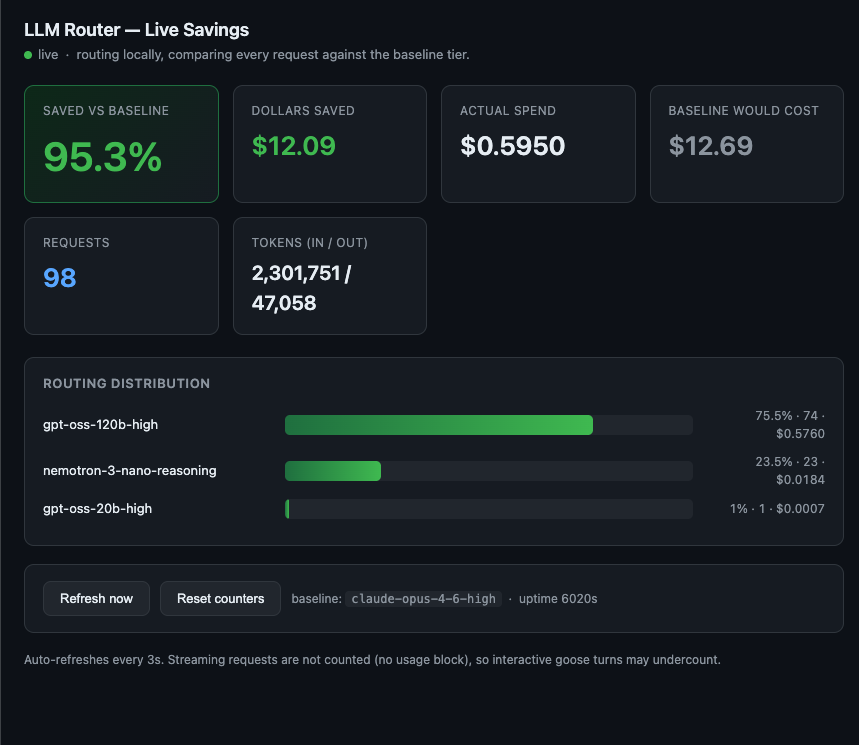

# NVIDIA AI Blueprint: LLM Router v3 — Complexity-Based Optimization

**Use the most efficient and accurate model for every LLM call.**

Model Router learns which models handle which types of queries well and routes each request to the most efficient model that meets your accuracy threshold. Instead of over-provisioning with a single large frontier model or under-serving with a small efficient one, the router matches query complexity to model capability automatically.

The core insight: lightweight models can handle a substantial set of queries correctly and efficiently. The router learns which queries those are, sends them to smaller models, and reserves large frontier models for the queries that genuinely need them.

> [!NOTE]
> **Reference implementation only.** This branch is a reference implementation demonstrating prefill-based LLM routing. For production deployment, please fork this repository and leverage the relevant components for your use case. If you encounter issues or have questions, please [open an issue](../../issues/new).

---

> **Branch: v3-prefill** — This branch contains LLM Router v3, a prefill complexity-based routing system that learns which models handle which queries well and routes each request to the most efficient model that meets your accuracy threshold. For the intent/multimodal router (v2), see the [experimental](../../tree/experimental) branch. For the original BERT-based router (v1), see [main](../../tree/main).

---

## Fork addendum: a *personalized* router for your own agent (goose)

> This fork extends the NVIDIA blueprint with one idea: **instead of training the
> router on generic benchmarks, train it on _your own_ assistant transcripts** —
> the actual prompts you type to a coding agent like [goose](https://github.com/block/goose).
> The router then learns which of *your* requests genuinely need a frontier model
> and which a cheap model handles fine, and routes accordingly behind an
> OpenAI-compatible proxy. It also ships a **live savings dashboard** so you can
> watch the cost reduction in real time as you work.



*The `/dashboard` endpoint: real-time % saved vs. a frontier baseline, routing
distribution across tiers, and a resettable counter — populated from your actual
streaming sessions.*

### Why personalize?

The upstream blueprint assumes you collect labels over benchmark-style questions
(MMLU, math, coding tasks judged by majority vote or ground-truth answers). That
produces a router calibrated for *textbook* difficulty. But your real traffic
doesn't look like a benchmark — it looks like *"list files here"*, *"any open PRs
from alex?"*, *"never force push, why would you do that"*. A router trained on
**your** distribution learns that most of that routes safely to a small model,
while reserving the top tier for the genuinely hard turns. In practice this fork
routes a real mix across tiers and reports **>90% cost savings** versus sending
everything to the frontier model.

### Train it for yourself

You build your own checkpoint from your own agent history — no shared weights
required (see [Pretrained weights](#pretrained-weights) below for why).

```bash
# 0. Install (see Getting Started) and activate the venv
pip install -e '.[proxy]'

# 1. Extract genuine prompts from your goose session history.
#    Reads ~/.local/share/goose/sessions/sessions.db, drops slash-commands,
#    compaction summaries, synthetic turns, near-duplicates; tags continuations.
python scripts/extract_goose_questions.py --out data/goose-questions.txt

# 2. Label them: send each question to every model in the pool and record
#    which models answer acceptably (majority-vote judging needs no ground truth).
model-router collect \
  --questions data/goose-questions.txt \
  --pool-config configs/goose-mix.yaml \
  --out data/goose-collected.csv

# 3. Train the prefill router (encoder hidden states -> PCA -> MLP per model).
model-router train \
  --data data/goose-collected.csv \
  --pool-config configs/goose-mix.yaml \
  --out checkpoints/prefill_router_goose.pt

# 4. (optional) Re-price the checkpoint's pool to match current provider costs.
python scripts/patch_checkpoint_costs.py \
  checkpoints/prefill_router_goose.pt configs/goose-mix.yaml
```

`configs/goose-mix.yaml` is the example pool used here — a tiered mix of
OpenAI/Anthropic models (cheap `gpt-*-nano` tiers up to a frontier
Claude Opus baseline). Edit it to match the models and prices you actually have
keys for; model **costs** drive the routing economics and the savings math.

### Run the proxy

```bash
# Start proxy + dashboard on :4000. Reads OPENAI_API_KEY/ANTHROPIC_API_KEY from
# the env, or falls back to the macOS "goose" keychain entry. Picks mps on Apple
# Silicon (~0.1-0.4s/route) else cpu (~9s/route).
./scripts/run.sh

# Override port:
PORT=4100 ./scripts/run.sh

# By hand (no helper):
model-router proxy-config --config configs/goose-mix.yaml --output configs/litellm-goose.yaml
ROUTER_DEVICE=mps model-router proxy \
  --router-config configs/goose-mix.yaml \
  --litellm-config configs/litellm-goose.yaml \
  --port 4000
```

### Point goose at it

```bash
LITELLM_HOST=http://localhost:4000 LITELLM_API_KEY=sk-local \
GOOSE_PROVIDER=litellm GOOSE_MODEL=nvidia-routed \
goose
```

### Run the verified-label (SWE-bench) router

The checkpoint trained on verified multi-model success (see `docs/LAB_NOTE.md`)
routes well on coding tasks. Serve it with its own pool:

```bash
ROUTER_DEVICE=mps model-router proxy \
  --router-config configs/swebench-pool.yaml \
  --litellm-config configs/litellm-swebench.yaml \
  --port 4000
# then point goose at it exactly as above (GOOSE_MODEL=nvidia-routed)
```

Note: this checkpoint learned from SWE-bench code-fixing tasks, so it routes best
on coding work. A router personalized to your own traffic needs verifiable
success labels from your own sessions — the open next step in the lab note.

### Endpoints

| Endpoint | Purpose |
|---|---|
| `POST /v1/chat/completions` | OpenAI-compatible — point goose / any client here |
| `GET  /dashboard` | live savings web page (auto-refreshes every 3s) |
| `GET  /savings` | same data as JSON |
| `POST /savings/reset` | zero the counters |

Streaming is counted (the proxy forces `stream_options.include_usage` and taps
the SSE stream). The dashboard tracks **cost, not answer quality**.

### Routed vs frontier: a real task

Same task (upgrade `iroh` rc.0 → rc.1 in a Rust workspace, fix API breaks,
validate), same repo context (`AGENTS.md` + skills), once routed (→ gpt-5-mini)
and once direct to Opus 4.8.

- **Code: a tie.** Both produced a correct migration and the same three API-break
  fixes.
- **Follow-through: Opus won.** The repo's `AGENTS.md` documents a validation
  procedure (build, clippy, multi-node + public-mesh tests). Opus read it and
  ran it end-to-end (built, tested 4/4 relay tests, joined the public mesh, ran a
  live inference round-trip). The routed model read the same file, built locally,
  then handed the validation back as a "recommendation."

The savings number can't see this: per-turn coding quality rarely needs a
frontier model, but **agentic completeness** (sustaining a long task to done)
does, and a cost dashboard won't show the difference.

### Pretrained weights

**This fork intentionally does not ship a trained `.pt` checkpoint, by design:**

1. **Privacy** — the weights are learned from personal assistant transcripts. They
   encode decision boundaries derived from real prompts, file paths, and repo/PR
   references. Sharing the artifact leaks more about the author's workload than it
   helps you.
2. **It wouldn't generalize** — a checkpoint trained on one person's coding-agent
   traffic will route *your* (e.g. legal, creative, support) traffic badly. The
   value here is the **method**, not the artifact. Building your own takes minutes.

If you want to distribute a checkpoint anyway, do it **out-of-band** rather than in
git history: a Hugging Face model repo (with a model card noting the training
source) or a GitHub Release asset are both clean options. `data/` and
`checkpoints/*.pt` are `.gitignore`d here for exactly these reasons.

### What this fork added on top of the blueprint

- `scripts/extract_goose_questions.py` — mine your goose `sessions.db` into clean training prompts.
- `configs/goose-mix.yaml` — example tiered OpenAI/Anthropic pool with per-model costs.
- `scripts/run-goose-proxy.sh` — one-command proxy launch; keychain key injection; GPU routing.
- Live **savings tracking**: `adapters/litellm/savings.py` + `dashboard.py`, wired into the proxy (`/dashboard`, `/savings`, `/savings/reset`), with **streaming (SSE) usage capture** so interactive agent sessions are counted accurately.
- `prefill/scorer.py` + `extract.py` — routing encoder device is now configurable via `ROUTER_DEVICE` (e.g. `mps` on Apple Silicon) instead of hardcoded CPU.
- Helper scripts: `bench_routing.py` (offline routing distribution), `collect_fast.py`, `patch_checkpoint_costs.py`, `tolerance_curve.py`.

---

### How This Branch Differs

| Feature | v1 (main) | v2 (experimental) | **v3-prefill (this branch)** |
|---------|-----------|-------------------|------------------------------|
| **Routing signal** | BERT classification | Intent (Qwen 1.7B) or CLIP+NN | Encoder hidden states → PCA → MLP |
| **Server** | Rust proxy | NeMo Agent Toolkit (FastAPI) | FastAPI + LiteLLM |
| **Training** | N/A | Notebook-driven | Full CLI pipeline (collect/train/evaluate) |
| **Models** | 2 | 3 | 9 (500x cost range) |
| **Multimodal** | No | Yes (images) | No (text only) |
| **Proxying** | Yes | No (classification only) | Yes (routing + inference) |
| **Deployment modes** | Docker | Docker | Library, server, sidecar, proxy, SDK |

---

## Table of Contents

- [The Problem](#the-problem)
- [How It Works](#how-it-works)
- [Components Overview](#components-overview)
- [Getting Started](#getting-started)
- [Features](#features)
  - [Route Queries (Python Library)](#route-queries-python-library)
  - [Serve (Standalone Server)](#serve-standalone-server)
  - [Serve (Router-Only Sidecar)](#serve-router-only-sidecar)
  - [LiteLLM Proxy Integration](#litellm-proxy-integration)
  - [LiteLLM Proxy + External Sidecar Hook](#litellm-proxy--external-sidecar-hook)
  - [LiteLLM SDK Integration](#litellm-sdk-integration)
  - [Collect Training Data](#collect-training-data)
  - [Train a Router](#train-a-router)
  - [Evaluate a Router](#evaluate-a-router)
  - [Playground UI](#playground-ui)
  - [Model Pinning](#model-pinning)
  - [Telemetry](#telemetry)
- [Model Pool](#model-pool)
- [Configuration](#configuration)
- [Environment Variables](#environment-variables)
- [Project Structure](#project-structure)
- [Development](#development)
- [In-Depth Guides](#in-depth-guides)

---

## The Problem

You have an LLM application calling one or more model providers. You face a tradeoff:

- **Small, efficient models** ($0.05–$0.25/M tokens) are fast and affordable but fail on hard questions.
- **Large frontier models** ($2.50–$25/M tokens) handle hard questions but cost 50–500x more.

Most production workloads are a mix: ~60% of queries are simple enough for the smallest model, ~30% need a mid-tier model, and ~10% genuinely need the most capable (and largest) model.

Sending everything to the large frontier model wastes money. Sending everything to the small efficient model loses accuracy. **Model Router Toolkit automatically picks the right model for each query.**

## How It Works

The routing algorithm has three phases: **training** (offline, once), **inference** (online, per-query), and **selection** (per-query).

### Training (Offline)

```
questions.txt ──> Collect ──> train.csv ──> Train ──> checkpoint.pt
                  (run all                  (learn which model
                   models,                   handles which queries)
                   judge correctness)
```

1. **Collect**: Run every model in the pool on a set of questions. Judge correctness via LLM-as-judge (default), majority vote, or reference answers. Output: a CSV of `question, model, isCorrect, output_tokens`.
2. **Train**: Pass each question through a lightweight encoder (Qwen3.5-0.8B, 0.8B params). Extract hidden state representations from the encoder's internal layers. These representations capture the "complexity signature" of each question. A small MLP learns to predict P(correct) for each model from these representations.

### Inference (Online, Per-Query)

```
"What is 2+2?"
       │
       ▼
   Encoder (Qwen3.5-0.8B)          ← single forward pass (~100ms GPU, ~5s CPU)
       │
       ▼
   Hidden states → PCA → MLP       ← microseconds
       │
       ▼
   P(correct) per model:
     nemotron-nano:    0.92
     gpt-oss-120b:     0.95
     claude-opus:      0.97
```

The encoder runs once per query. No target model is called during routing — the router predicts correctness probabilities from the question text alone.

### Selection

```
   P(correct) per model:            Cost per model:
     nemotron-nano:    0.92           $0.05/M
     gpt-oss-120b:     0.95           $0.43/M
     claude-opus:      0.97           $25.78/M

   tolerance = 0.20 → threshold = 0.97 - 0.20 = 0.77

   Models above threshold:
     nemotron-nano  ✓  (0.92 ≥ 0.77)  → most efficient ✓ SELECTED
     gpt-oss-120b   ✓  (0.95 ≥ 0.77)
     claude-opus    ✓  (0.97 ≥ 0.77)
```

The `tolerance` parameter controls the accuracy–cost tradeoff:
- `tolerance = 0.0` → always pick the model with the highest P(correct), regardless of cost
- `tolerance = 0.20` (default) → allow up to 20 percentage points below the best for a smaller, more efficient model
- `tolerance = 1.0` → always pick the smallest model in the pool

> **Research paper coming soon.** A paper detailing the research behind this routing technique — including the complexity-signal extraction method, encoder-layer selection, and evaluation methodology — will be published shortly.

## Components Overview

The toolkit has **four layers**. Each layer is independent and can be used separately.

### 1. Core Routing Engine

The heart of the system. Pure Python, no framework dependencies.

| Component | What it does |
|-----------|-------------|
| `BaseRouter` | Abstract interface: `route(question) → RoutingResult` |
| `PrefillRouter` | Concrete implementation: encoder → hidden states → MLP → selection |
| `PoolConfig` | YAML-driven model pool definition (names, costs, endpoints) |
| `RoutingResult` | Output: selected model, per-model confidences, cost estimates |

### 2. Training Pipeline

Offline batch processing to build routing checkpoints. No server needed.

| Component | What it does |
|-----------|-------------|
| `collect` | Runs models on questions, judges correctness → CSV |
| `train` | Extracts features, sweeps hyperparameters, trains MLP ensemble → `.pt` checkpoint |
| `evaluate` | Measures routing quality: AUC, accuracy, lift, agreement analysis |

### 3. Adapters

Platform integrations that connect the routing engine to real infrastructure. Each adapter is a thin wrapper — the core has zero knowledge of adapters.

| Adapter | Install Extra | What it does |
|---------|---------------|-------------|
| **LiteLLM Strategy** | `[litellm]` | Embed routing in any `litellm.Router` — 4 lines of Python |
| **Standalone Server** | `[litellm]` | Full server: routing + inference + playground UI |
| **LiteLLM Proxy** | `[proxy]` | Inject routing into LiteLLM Proxy at startup (in-process) |
| **External Sidecar Hook** | none (proxy-side only) | LiteLLM Proxy `CustomLogger` callback that delegates routing to a separately-running sidecar |
| **Router Sidecar** | `[server]` | Route-only HTTP API (`POST /v1/route`), no inference |
| **Webhook Auth** | `[server]` | HMAC-SHA256 / bearer token middleware for the sidecar |

### 4. Plugins

Gateway plugins for external platforms (no Python dependency).

| Plugin | What it does |
|--------|-------------|
| **OpenClaw** | TypeScript plugin for OpenClaw's `before_model_resolve` hook |

### How the Pieces Fit Together

```
                    ┌─────────────────────────────┐
                    │       Your Application       │
                    └──────┬──────────────┬────────┘
                           │              │
              ┌────────────▼──┐    ┌──────▼─────────┐
              │ LiteLLM SDK   │    │  HTTP Client    │
              │ (Strategy)    │    │  (Sidecar API)  │
              └────────┬──────┘    └──────┬──────────┘
                       │                  │
              ┌────────▼──────────────────▼──────────┐
              │         Adapter Layer                 │
              │   litellm/strategy.py  http/route.py  │
              └────────────────┬──────────────────────┘
                               │
              ┌────────────────▼──────────────────────┐
              │         Core Routing Engine            │
              │   PrefillRouter.route(question)        │
              │     → Encoder → PCA → MLP → Select    │
              └────────────────┬──────────────────────┘
                               │
              ┌────────────────▼──────────────────────┐
              │         Checkpoint (.pt)               │
              │   Transforms + MLP weights + Config    │
              └───────────────────────────────────────┘
```

---

## Getting Started

### Install

Pick extras based on what you need:

| Extra | What it adds | When you need it |
|-------|-------------|-----------------|
| *(none)* | Core routing engine | Library use only (no server, no encoder) |
| `[prefill]` | torch, transformers, accelerate | Routing with the prefill encoder (recommended) |
| `[server]` | FastAPI, uvicorn | Router-only HTTP sidecar |
| `[litellm]` | litellm, FastAPI, uvicorn | Standalone server or LiteLLM SDK integration |
| `[proxy]` | litellm[proxy] | LiteLLM Proxy injection |
| `[training]` | litellm | Data collection (`model-router collect`) |
| `[dev]` | pytest, ruff, mypy | Testing and linting |
| `[all]` | Everything | Full development setup |

```bash
# Recommended: prefill routing + standalone server
pip install -e '.[prefill,litellm]'

# Router sidecar only (no inference, no litellm)
pip install -e '.[prefill,server]'

# Full development setup
pip install -e '.[all]'
```

### Prerequisites

- Python 3.10+
- **Git LFS** — checkpoints and data files are stored with [Git LFS](https://git-lfs.com). After cloning, pull the actual files:
  ```bash
  git lfs install
  git lfs pull
  ```
  Without this step, checkpoint files will be small LFS pointer files and the router will fail to load.
- A trained checkpoint file (`.pt`) — the repo includes pre-trained checkpoints in `checkpoints/`
- An API key for your model provider (only needed for serving/collecting, not for routing itself)

### Quick Test (No API Key)

Route a query using just the local encoder and checkpoint — no API key, no server, no network:

```python
from model_router_toolkit.config import load_config, build_router_from_config

config = load_config("configs/v1-9models-qwen08b.yaml")
router = build_router_from_config(config)

result = router.route("What is the capital of France?", tolerance=0.20)
print(f"Selected: {result.selected_model}")
print(f"Confidence: {result.selected_confidence:.3f}")
print(f"All confidences: {dict(zip(result.model_names, result.confidences))}")
```

### Quick Test (With Server)

```bash
export OPENROUTER_API_KEY=your-key
model-router serve --config configs/v1-9models-qwen08b.yaml --port 8000
```

Open `http://localhost:8000/` for the interactive playground, or call the API:

```bash
curl http://localhost:8000/v1/chat/completions \
  -H "Content-Type: application/json" \
  -d '{"model": "routed", "messages": [{"role": "user", "content": "What is 2+2?"}]}'
```

---

## Features

### Route Queries (Python Library)

Use the router directly in Python. No server, no API keys, fully offline.

```python
from model_router_toolkit.config import load_config, build_router_from_config

config = load_config("configs/v1-9models-qwen08b.yaml")
router = build_router_from_config(config)

# Route a question
result = router.route("Explain the Riemann hypothesis", tolerance=0.15)

print(result.selected_model)       # "qwen-3-5-122b"
print(result.selected_confidence)  # 0.847
print(result.selected_cost)        # CostEstimate(...)

# Restrict to a subset of models
result = router.route("What is 2+2?", models=["nemotron-3-nano-reasoning", "gpt-oss-20b-high"])

# Unload when done (frees encoder memory)
router.unload()
```

**When to use**: You have your own inference pipeline and just need model selection decisions.

### Serve (Standalone Server)

Full server with routing, inference (via LiteLLM), and an interactive playground UI.

```bash
pip install -e '.[prefill,litellm]'
export OPENROUTER_API_KEY=your-key

model-router serve --config configs/v1-9models-qwen08b.yaml --port 8000
```

**Endpoints**:

| Endpoint | Method | Description |
|----------|--------|-------------|
| `/` | GET | Playground UI |
| `/health` | GET | Health check |
| `/api/models` | GET | List models in pool |
| `/api/config` | GET | Current routing config |
| `/v1/chat/completions` | POST | OpenAI-compatible chat (routes + calls model) |
| `/api/chat` | POST | SSE streaming for playground |
| `/api/review` | POST | Auto-judge answer correctness |

The `/v1/chat/completions` endpoint is OpenAI-compatible — any client that works with OpenAI's API works here, with automatic routing.

**When to use**: Demos, local development, small-scale deployment.

### Serve (Router-Only Sidecar)

Returns routing decisions only — no inference, no API keys, minimal dependencies.

```bash
pip install -e '.[prefill,server]'

model-router serve-router --config configs/v1-9models-qwen08b.yaml --port 8079
```

**Endpoints**:

| Endpoint | Method | Description |
|----------|--------|-------------|
| `/health` | GET | Health check |
| `/api/models` | GET | List models in pool |
| `/v1/route` | POST | Returns routing decision (no inference) |

```bash
curl -X POST http://localhost:8079/v1/route \
  -H "Content-Type: application/json" \
  -d '{"question": "What is 2+2?", "tolerance": 0.20}'
```

Response:

```json
{
  "selected_model": "nemotron-3-nano-reasoning",
  "model_names": ["nemotron-3-nano-reasoning", "gpt-oss-20b-high", "..."],
  "confidences": [0.92, 0.89, "..."],
  "costs": [{"median_output_tokens": 150, "cost_per_m_input_tokens": 0.05, "..."}],
  "metadata": {}
}
```

You can also pass OpenAI-style messages instead of a plain question:

```bash
curl -X POST http://localhost:8079/v1/route \
  -H "Content-Type: application/json" \
  -d '{"messages": [{"role": "user", "content": "What is 2+2?"}]}'
```

**When to use**: Gateway integrations, existing inference pipelines, microservice architectures where routing and inference are separate.

### LiteLLM Proxy Integration

Drop routing into an existing LiteLLM Proxy deployment. Keeps all of LiteLLM's features (auth, rate limiting, spend tracking) and adds intelligent routing.

```bash
pip install -e '.[prefill,proxy]'

# Generate LiteLLM config from your pool config
model-router proxy-config \
  --config configs/v1-9models-qwen08b.yaml \
  --output configs/litellm-proxy.yaml

# Start proxy with routing
model-router proxy \
  --litellm-config configs/litellm-proxy.yaml \
  --router-config configs/v1-9models-qwen08b.yaml \
  --port 4000
```

The proxy runs as a standard LiteLLM Proxy with the routing strategy injected at startup.

**When to use**: Production deployments, teams already using LiteLLM, environments needing auth/rate-limiting/caching.

### LiteLLM Proxy + External Sidecar Hook

Same end result as the in-process proxy integration, but the encoder runs in a separate Router Sidecar process. The proxy stays vanilla (no `[prefill]` install, no GPU memory) and consults the sidecar over HTTP for each routing decision.

```bash
# 1. Start the router sidecar (CPU or GPU)
pip install -e '.[prefill,server]'
model-router serve-router --config configs/v1-9models-qwen08b.yaml --port 8079

# 2. In your LiteLLM Proxy environment (no [prefill] needed):
pip install -e '.'                  # core only — provides the hook module
pip install 'litellm[proxy]'        # standard LiteLLM Proxy

export ROUTER_SIDECAR_URL=http://router-sidecar:8079
export ROUTER_SIDECAR_DEFAULT_MODEL=gpt-oss-120b-high   # fail-open target
```

Wire the hook into the proxy's `config.yaml`:

```yaml
model_list:
  - model_name: nemotron-3-nano-reasoning
    litellm_params: { model: openrouter/nvidia/nemotron-3-nano-30b-a3b }
  - model_name: gpt-oss-120b-high
    litellm_params: { model: openrouter/openai/gpt-oss-120b }
  # ... one entry per pool model; model_name must match the router's pool

litellm_settings:
  callbacks: model_router_toolkit.adapters.litellm.external_hook.external_router_hook
  fallbacks:
    - gpt-oss-120b-high: [nemotron-3-super]
  num_retries: 2
```

The hook rewrites `data["model"]` from the sidecar's decision before LiteLLM dispatches. Ships with a circuit breaker and configurable fail-open default — if the sidecar is down, requests still flow through to the default model. See [docs/guide-adapters-and-plugins.md](docs/guide-adapters-and-plugins.md#external-sidecar-hook-external_hookpy) for the full reference.

**When to use**: Production deployments where you want to scale, restart, or GPU-pin the router independently of the LiteLLM Proxy. Also useful when multiple LiteLLM Proxies share a single router.

### LiteLLM SDK Integration

Embed routing in any Python app that uses `litellm.Router`:

```python
from litellm import Router
from model_router_toolkit import ModelRoutingStrategy

# Set up LiteLLM router with your model list
litellm_router = Router(model_list=[
    {"model_name": "nemotron-3-nano-reasoning", "litellm_params": {"model": "openrouter/nvidia/nemotron-3-nano-30b-a3b"}},
    {"model_name": "gpt-oss-120b-high", "litellm_params": {"model": "openrouter/openai/gpt-oss-120b"}},
])

# Create and attach the routing strategy
strategy = ModelRoutingStrategy.from_config("configs/v1-9models-qwen08b.yaml")
strategy.set_litellm_router(litellm_router)
litellm_router.set_custom_routing_strategy(strategy)

# Now every call is automatically routed
response = await litellm_router.acompletion(
    model="nemotron-3-nano-reasoning",  # any pool model name
    messages=[{"role": "user", "content": "What is quantum computing?"}],
)
```

**When to use**: Existing Python apps using LiteLLM, minimal integration effort.

### Collect Training Data

Run every model in your pool on a set of questions and judge correctness. This produces the CSV needed for training.

```bash
pip install -e '.[prefill,training]'
export OPENROUTER_API_KEY=your-key

# LLM-as-judge (default) — a judge model evaluates each answer independently
model-router collect \
  --config configs/v1-9models-qwen08b.yaml \
  --questions questions.txt \
  --output data/collected.csv

# Custom judge model (any litellm-compatible model)
model-router collect \
  --config configs/v1-9models-qwen08b.yaml \
  --questions questions.txt \
  --output data/collected.csv \
  --judge-model openrouter/anthropic/claude-opus-4-6

# Majority vote judging (no judge model needed, but fragile for open-ended answers)
model-router collect \
  --config configs/v1-9models-qwen08b.yaml \
  --questions questions.txt \
  --output data/collected.csv \
  --judge vote

# Reference-based judging (when you have ground truth)
model-router collect \
  --config configs/v1-9models-qwen08b.yaml \
  --questions questions.txt \
  --output data/collected.csv \
  --judge reference --references answers.csv
```

**Judging methods**:

| Method | Flag | Description |
|--------|------|-------------|
| `llm` (default) | `--judge llm` | A judge LLM evaluates each answer independently. Default judge: Nemotron 3 Super (free tier). Override with `--judge-model`. |
| `vote` | `--judge vote` | Majority consensus across all models. No external judge needed, but unreliable for open-ended or creative answers. |
| `reference` | `--judge reference --references answers.csv` | Exact match against ground-truth answers from a CSV with `question,answer` columns. |

**Input**: `questions.txt` — one question per line.

**Output CSV format**:

| Column | Description |
|--------|-------------|
| `question` | The question text |
| `model` | Model name (matches config) |
| `isCorrect` | 1 = correct, 0 = incorrect |
| `output_tokens` | Token count of the model's response |

**When to use**: Building a custom router for your specific workload/model pool.

### Train a Router

Train a routing checkpoint from labeled data.

```bash
pip install -e '.[prefill]'

model-router train \
  --config configs/v1-9models-qwen08b.yaml \
  --data data/train.csv \
  --output-dir checkpoints/
```

The training pipeline:
1. Loads labels from CSV
2. Runs the encoder (Qwen3.5-0.8B) on all questions — cached automatically
3. Sweeps layer, pooling mode, and PCA dimension per target model
4. Fits StandardScaler + PCA transforms
5. Trains a SharedTrunkNet MLP ensemble (10 seeds, keeps best 5)
6. Saves a self-contained `.pt` checkpoint

**Key options**:

| Flag | Default | Description |
|------|---------|-------------|
| `--device` | auto-detect | `cpu`, `cuda`, or `mps` |
| `--n-seeds` | 10 | Ensemble seeds to train |
| `--n-keep` | 5 | Best seeds to keep |
| `--pca-dims` | 50,100,150,200,300 | PCA dimensions to sweep |
| `--epochs` | 150 | Max MLP training epochs |
| `--patience` | 15 | Early stopping patience |
| `--batch-size` | 4 | Encoder extraction batch size |

No API key needed — training runs entirely locally with the encoder model.

**When to use**: After collecting data, to build or update a routing checkpoint.

### Evaluate a Router

Measure how well a trained router performs on held-out test data.

```bash
model-router evaluate \
  --config configs/v1-9models-qwen08b.yaml \
  --checkpoint checkpoints/prefill_router_qwen08b.pt \
  --data data/test.csv
```

The evaluation report includes:
- **Per-model AUC**: How well the router predicts each model's correctness (> 0.70 is useful, > 0.80 is strong)
- **Oracle vs Router accuracy**: Theoretical ceiling vs what the router achieves
- **Lift**: How much better routing is vs always using the single best model
- **Headroom captured**: What percentage of the possible improvement the router captures
- **Routing distribution**: How traffic splits across models
- **Agreement zones**: Performance on easy (all-correct), contested (disagree), and hard (all-wrong) questions
- **Near-miss analysis**: How close wrong decisions were to being right
- **Pairwise win rates**: When model A is correct and B is wrong, does the router give A higher confidence?

No API key needed — evaluation runs entirely locally.

**When to use**: After training, to validate quality before deploying.

### Playground UI

The standalone server (`model-router serve`) includes an interactive web UI at the root path (`/`).

Features:
- Chat interface with streaming responses
- Tolerance slider to adjust cost–accuracy tradeoff in real-time
- Model toggle switches to include/exclude models from routing
- Routing visualization showing which model was selected and why
- Per-model confidence bars
- Cost tracking (per-query and session totals)
- Auto-review: automatically judges answer correctness after each response
- Prompt chips for quick testing

### Model Pinning

All adapters support **model pinning** — forcing a specific model without running the router. Useful for multi-turn conversations where you want the first turn routed but subsequent turns to use the same model.

| Adapter | How to pin |
|---------|-----------|
| LiteLLM Strategy | `metadata={"pin_model": "model-name"}` |
| HTTP Sidecar | `{"model": "model-name"}` in the request body |
| Direct Python | Call `router.resolve("model-name")` |

**Example: router-per-agent pattern**

```python
# First turn: let the router decide
result = router.route("Explain quantum computing")
chosen = result.selected_model  # "gpt-oss-120b-high"

# Subsequent turns: pin to the same model
result = router.resolve(chosen)  # instant, no ML inference
```

### Telemetry

Optional SQLite-based logging of routing decisions. Disabled by default.

```bash
export ROUTER_TELEMETRY_DB=/path/to/telemetry.db
```

When enabled, logs session creation and per-chat events (question, selected model, latency). Query stats via:

```python
from model_router_toolkit.telemetry import get_stats
stats = get_stats()  # total_events, total_sessions, avg_latency_ms, by_model
```

---

## Model Pool

The default pool (`configs/v1-9models-qwen08b.yaml`) includes 9 models spanning a ~500x cost range:

| Model | Provider | Input Cost ($/M) | Output Cost ($/M) |
|-------|----------|------------------:|-------------------:|
| Nemotron 3 Nano (Reasoning) | OpenRouter/NVIDIA | $0.050 | $0.200 |
| GPT-OSS 20B High | OpenRouter/OpenAI | $0.052 | $0.245 |
| Nemotron 3 Super | OpenRouter/NVIDIA | $0.100 | $0.400 |
| GPT-OSS 120B High | OpenRouter/OpenAI | $0.113 | $0.431 |
| Qwen 3.5 35B | OpenRouter/Qwen | $0.163 | $1.300 |
| Qwen 3.5 122B | OpenRouter/Qwen | $0.260 | $2.080 |
| GPT-5.2 High | OpenRouter/OpenAI | $0.844 | $14.000 |
| GPT-5.4 High | OpenRouter/OpenAI | $2.500 | $15.000 |
| Claude Opus 4.6 High | OpenRouter/Anthropic | $2.770 | $25.780 |

Two encoder configurations are provided:

| Config | Encoder | Checkpoint | Tradeoff |
|--------|---------|------------|----------|
| `v1-9models-qwen08b.yaml` | Qwen3.5-0.8B (0.8B params) | `prefill_router_qwen08b.pt` | Faster inference, smaller memory |
| `v1-9models-qwen35b.yaml` | Qwen3.5-35B-A3B (35B MoE) | `prefill_router_qwen35b.pt` | Higher AUC, better cost–coverage |

---

## Configuration

Pool configs are YAML files with two sections:

```yaml
routing:
  method: prefill                              # routing method (only "prefill" currently)
  checkpoint: checkpoints/prefill_router.pt    # path to trained checkpoint
  tolerance: 0.20                              # accuracy–cost tradeoff [0.0, 1.0]
  encoder: Qwen/Qwen3.5-0.8B                  # HuggingFace model for feature extraction
  encoder_backend: transformers                # "transformers" (default)

models:
  - name: my-small-model                        # unique name (must match training CSV)
    display_name: My Small Model                # human-readable name (optional)
    litellm_model: openrouter/provider/model   # LiteLLM model identifier
    cost_per_m_input_tokens: 0.05              # cost per million input tokens
    cost_per_m_output_tokens: 0.20             # cost per million output tokens
    system_prompt: "Be concise."               # prepended system message (optional)
    chat_template_kwargs:                      # encoder template kwargs (optional)
      enable_thinking: true
    api_base: ""                               # custom API base URL (optional)
```

See [docs/guide-configuration.md](docs/guide-configuration.md) for the full reference.

## Environment Variables

| Variable | Required For | Description |
|----------|-------------|-------------|
| `OPENROUTER_API_KEY` | Serving, collecting (OpenRouter configs) | API key for OpenRouter |
| `NVIDIA_API_KEY` | Serving, collecting (NVIDIA configs) | API key for NVIDIA NIM / build.nvidia.com |
| `OPENAI_API_KEY` | Serving, collecting (OpenAI configs) | Fallback API key for OpenAI-compatible providers |
| `ROUTER_WEBHOOK_SECRET` | Router sidecar with auth | Shared secret for HMAC-SHA256 / bearer auth |
| `CORS_ORIGINS` | Servers with restricted CORS | Comma-separated allowed origins (default: `*`) |
| `ROUTER_DEVICE` | Serve/sidecar/proxy modes | Override device auto-detection: `cpu`, `cuda`, `mps` |
| `ROUTER_TELEMETRY_DB` | Optional telemetry | Path to SQLite file for session/chat logging |
| `ROUTER_SIDECAR_URL` | External sidecar hook | URL of the running router sidecar, e.g. `http://router:8079` |
| `ROUTER_SIDECAR_TIMEOUT_S` | External sidecar hook | HTTP timeout for sidecar calls (default: `2.0`) |
| `ROUTER_SIDECAR_TOLERANCE` | External sidecar hook | Default tolerance sent to the sidecar (default: `0.20`) |
| `ROUTER_SIDECAR_DEFAULT_MODEL` | External sidecar hook | Fallback model when the sidecar is unreachable; unset = re-raise |
| `ROUTER_SIDECAR_FAILURES_BEFORE_OPEN` | External sidecar hook | Circuit-breaker threshold (default: `5`) |
| `ROUTER_SIDECAR_OPEN_DURATION_S` | External sidecar hook | Cooldown after the breaker opens (default: `30`) |

**Not needed** for `train`, `evaluate`, or direct Python library use — these work fully offline.

---

## Project Structure

```
model-router-toolkit/
├── src/model_router_toolkit/
│   ├── __init__.py           # Public API: PoolConfig, BaseRouter, RoutingResult, ...
│   ├── __main__.py           # CLI entry point (model-router command)
│   ├── config.py             # PoolConfig, ModelSpec, load_config, build_router_from_config
│   ├── router.py             # BaseRouter ABC, RoutingResult, CostEstimate
│   ├── checkpoint.py         # Checkpoint loading utilities
│   ├── gpu.py                # GPU detection and VRAM checks
│   ├── train.py              # Training entry point (dispatches to prefill/train.py)
│   ├── evaluate.py           # Evaluation with rich metrics
│   ├── collect.py            # Data collection (run models + judge correctness)
│   ├── telemetry.py          # Optional SQLite session/chat logging
│   │
│   ├── prefill/              # Prefill routing method
│   │   ├── router.py         # PrefillRouter (BaseRouter implementation)
│   │   ├── scorer.py         # Load checkpoint, score questions
│   │   ├── extract.py        # Run encoder, extract hidden states
│   │   ├── transforms.py     # StandardScaler + PCA pipelines
│   │   ├── trunk.py          # SharedTrunkNet MLP, ensemble training
│   │   ├── sweep.py          # Hyperparameter grid search (layer/mode/PCA)
│   │   └── train.py          # Full training pipeline orchestration
│   │
│   ├── adapters/
│   │   ├── litellm/          # LiteLLM integration
│   │   │   ├── strategy.py   # ModelRoutingStrategy for litellm.Router
│   │   │   ├── app.py        # Standalone server (routing + inference + UI)
│   │   │   ├── proxy.py      # LiteLLM Proxy injection (in-process)
│   │   │   ├── external_hook.py  # LiteLLM Proxy callback delegating to a sidecar
│   │   │   ├── config_bridge.py  # Pool config → LiteLLM config generator
│   │   │   ├── completions.py    # /v1/chat/completions endpoint
│   │   │   ├── chat.py           # /api/chat SSE endpoint
│   │   │   ├── review.py         # /api/review auto-judge endpoint
│   │   │   └── static/           # Playground UI (HTML/JS/CSS)
│   │   │
│   │   └── http/             # Router-only sidecar
│   │       ├── app.py        # FastAPI app (no inference)
│   │       ├── route.py      # POST /v1/route endpoint
│   │       ├── auth.py       # WebhookAuthMiddleware
│   │       └── _shared.py    # Warmup, health, models helpers
│   │
│   └── plugins/
│       └── openclaw/         # OpenClaw gateway plugin (TypeScript)
│           ├── index.ts
│           ├── openclaw.plugin.json
│           └── package.json
│
├── configs/                  # Pool config YAMLs
├── checkpoints/              # Trained routing checkpoints (.pt)
├── data/                     # Training/test CSVs (gitignored)
├── notebooks/                # Quickstart notebooks
├── tests/                    # Unit and integration tests
├── scripts/                  # Install, reproduce, build scripts
└── docs/                     # In-depth feature guides
```

---

## Development

```bash
# Install everything
pip install -e '.[all]'

# Run unit tests
pytest tests/ --ignore=tests/integration/ -v

# Run integration tests (needs API keys)
pytest tests/integration/ -v

# All tests with coverage
pytest tests/ -v --cov=model_router_toolkit --cov-report=term-missing

# Lint and format
ruff check src/ tests/
ruff format src/ tests/
mypy src/
```

---

## In-Depth Guides

| Guide | What it covers |
|-------|---------------|
| [How Routing Works](docs/guide-how-it-works.md) | The routing algorithm end-to-end: encoder, hidden states, PCA, MLP, selection logic |
| [Data Collection](docs/guide-data-collection.md) | Collecting training data: judging methods, question design, data splitting |
| [Training & Evaluation](docs/guide-training-and-evaluation.md) | Full training pipeline, hyperparameters, evaluation metrics, interpreting results |
| [Serving & Deployment](docs/guide-serving-and-deployment.md) | All deployment modes: standalone server, sidecar, proxy, SDK, direct Python |
| [Configuration Reference](docs/guide-configuration.md) | Complete YAML schema, every field explained, starter templates |
| [Adapters & Plugins](docs/guide-adapters-and-plugins.md) | LiteLLM adapter, HTTP adapter, OpenClaw plugin, writing custom adapters |

---

## License

Apache-2.0
